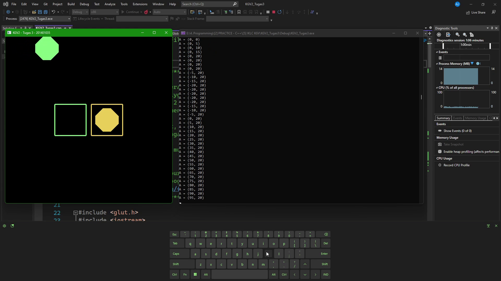

# Komputer Grafik Visualisasi (Lab)
#### Tugas Mata Praktikum Komputer Grafik dan Visualisasi Lab 2
#### Asisten Laboratorium: Annisa Mukhri
#### Tahun Ajaran: Genap 2020/2021
#### Ilmu Komputer - Universitas Sumatera Utara

# 
**Nama: Andrew Benedictus Jamesie**  
**NIM: 201401035**  
**Kom: A**  

# 
## KGV2_Tugas3
**YouTube Video:**  

> - Project ini merupakan sebuah program _game_/permainan yang bertujuan untuk memasukkan dua (2) objek bangun datar oktagon (octagon) ke dalam masing-masing kotak persegi dengan warna yang sama.
> - Folder ini merupakan Project/Solution **Console App C++** Visual Studio.
> - Dalam folder ini terdapat file Program `.sln` (Microsoft Visual Studio Solution) yang dapat dibuka dengan menggunakan Visual Studio, yaitu `KGV2_Tugas3.sln`.
> - Sedangkan jika hanya ingin melihat _source code_ Form Design-nya terdapat pada file `.cpp` (C++ Source File), yaitu `KGV2_Tugas3.cpp`.
> - Pada Project/Solution ini menggunakan _library_ [freeglut](http://freeglut.sourceforge.net "The Free OpenGL Utility Toolkit"), yaitu _open-source library_ alternatif dari OpenGL Utility Toolkit (GLUT).
