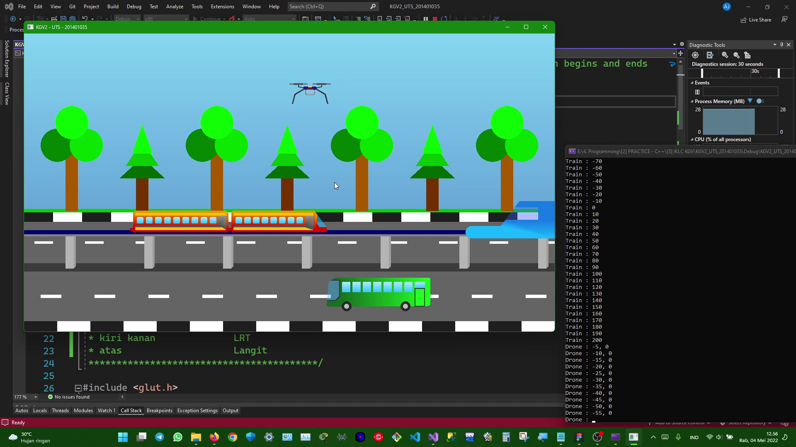

# Komputer Grafik Visualisasi (Lab)
#### Tugas Mata Praktikum Komputer Grafik dan Visualisasi Lab 2
#### Asisten Laboratorium: Annisa Mukhri
#### Tahun Ajaran: Genap 2021/2022
#### Ilmu Komputer - Universitas Sumatera Utara

# 
**Nama: Andrew Benedictus Jamesie**  
**NIM: 201401035**  
**Kom: A**  
**Lab: 2**  

# 
## KGV2_Tugas3
**YouTube Video:**  

> - Project ini merupakan sebuah program **_game_/permainan** yang bertujuan untuk **memasukkan dua (2)** objek bangun datar **oktagon (octagon) ke** dalam masing-masing kotak **persegi** dengan **warna yang sama**.
> - Folder ini merupakan Project/Solution **Console App C++** Visual Studio.
> - Dalam folder ini terdapat file Program `.sln` (Microsoft Visual Studio Solution) yang dapat dibuka dengan menggunakan Visual Studio, yaitu `KGV2_Tugas3.sln`.
> - Sedangkan jika hanya ingin melihat _source code_ Form Design-nya terdapat pada file `.cpp` (C++ Source File), yaitu `KGV2_Tugas3.cpp`.
> - Pada Project/Solution ini menggunakan _library_ [freeglut](http://freeglut.sourceforge.net "The Free OpenGL Utility Toolkit"), yaitu _open-source library_ alternatif dari OpenGL Utility Toolkit (GLUT).

# 
## KGV2_UTS
**YouTube Video:**  

> - Project ini merupakan sebuah program **simulasi kendaraan di jalan raya**, yaitu sebuah **mobil bus**, sebuah _**drone**_ di udara, dan **kereta _monorail_** yang dapat digerakkan dengan menggunakan _**keyboard**_ dan _**mouse**_. Terdapat juga beberapa pohon di pinggir jalan dan juga stasiun kereta _monorail_.
> - **Mobil bus** dapat digerakkan **empat (4) arah** dengan tombol keyboard, yaitu `atas (u/U)`, `bawah (j/J)`, `kiri (h/H)`, dan `kanan (k/K)`.
> - _**Drone**_ juga dapat digerakkan **empat (4) arah** dengan tombol keyboard, yaitu `atas (u/U)`, `bawah (j/J)`, `kiri (h/H)`, dan `kanan (k/K)`.
> - **Kereta _monorail_** dapat digerakkan **dua (2) arah** dengan tombol di mouse, yaitu `klik kiri`, dan `klik kanan`.
> - Fitur yang di-_highlight_ pada _project_ simulasi ini adalah kemampuan simulasi **kendaraan** yang memiliki **efek berputar (loop)** pada objek kendaraan di saat koordinat objek kendaraan sudah mencapai akhir batas _window_ program, baik di kiri maupun di kanan. Objek kendaraan akan berulang, misalnya jika kendaraan sudah mencapai batas akhir atau ujung _window border_ di kiri, maka kendaraan akan berlanjut tampil di ujung _window_ di sebelah kanan. Begitu juga sebaliknya, jika kendaraan sudah mencapai batas akhir atau ujung _window border_ di kanan. maka kendaraan akan berlanjut tampil di ujung _window_ di sebelah kiri.
> - Fitur spesial pada _drone_ juga terdapat pada teknologi kontrol pergerakan koordinat _drone_ itu sendiri. Pergerakan _drone_ dibatasi hingga paling tinggi berada pada batas atau ujung _window border_ atas, yaitu langit dan paling bawah, yaitu trotoar. _Drone_ juga memiliki fitur keamanan dalam kontrol koordinatnya, yaitu _drone_ tidak dapat bergerak ke kiri atau kanan jika menyentuh batas bawah (trotar), sehingga menandakan bahwa **_drone_ tersebut telah mendarat**. Untuk menerbangkannya kembali cukup menaikkan _drone_ tersebut, dan _drone_ pun dapat bergerak bebas kembali.
> - Fitur lainnya yaitu kaca pengendara mobil, kereta _monorail_, dan juga kaca stasiun dirancang menggunakan objek yang transparan. Sedangkan kaca lainnya pada bagian penumpang dirancang menggunakan objek yang buram (_opaque_) agar dapat meningkatkan privasi penumpang yang berada di dalam kendaraan tersebut.
> - Folder ini merupakan Project/Solution **Console App C++** Visual Studio.
> - Dalam folder ini terdapat file Program `.sln` (Microsoft Visual Studio Solution) yang dapat dibuka dengan menggunakan Visual Studio, yaitu `KGV2_UTS_201401035.sln`.
> - Sedangkan jika hanya ingin melihat _source code_ Form Design-nya terdapat pada file `.cpp` (C++ Source File), yaitu `KGV2_UTS_201401035.cpp`.
> - Pada Project/Solution ini menggunakan _library_ [freeglut](http://freeglut.sourceforge.net "The Free OpenGL Utility Toolkit"), yaitu _open-source library_ alternatif dari OpenGL Utility Toolkit (GLUT).

